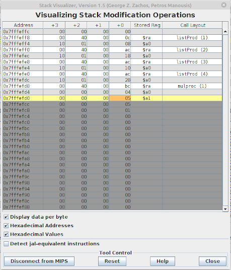

# mars-stack-visualizer

## About Mars
[MARS](http://courses.missouristate.edu/KenVollmar/mars/) is a lightweight interactive
development environment (IDE) for programming in MIPS assembly language, intended for
educational-level use with Patterson and Hennessy's Computer Organization and Design.
Developed by Pete Sanderson (psanderson@otterbein.edu) and Kenneth Vollmar (kenvollmar@missouristate.edu).

## About this project
The StackVisualizer tool and application allows the user to view in real time the
memory modification operations taking place in the stack segment with emphasis to
`$sp`-relative memory accesses. The user can also observe how pushes/pops to/from
the stack take place. The address pointed by the stack pointer is displayed in an
orange background while the whole word-length data in yellow. Lower addresses
have a grey background (given that stack growth takes place from higher to lower addresses).
The names of the registers whose contents are stored in the stack, are shown in the
"Stored Reg" column. In the "Call Layout" column, the subroutine frame (activation record)
layout is displayed, with subroutine names placed on the first address written in
the corresponding frame. 



### Tool Options
 * "Display data per byte": When enabled, the bytes of each word (4 Bytes) are displayed separately.
 * "Hexadecimal Addresses": Whether memory addresses are formatted in hexadecimal or decimal representation.
 * "Hexadecimal Values": Whether memory content is formatted in hexadecimal or decimal representation.
 * "Detect jal-equivalent instructions": Whether instruction sequences equivalent to `jal` should be detected. i.e. `la $ra, somelabel` immediately followed by `j somelabel`.


## Project Supervisor
 - [Aris Efthymiou](https://www.cse.uoi.gr/~efthym)

## Project Developers
 - [George Z. Zachos](https://www.cse.uoi.gr/~gzachos)
 - [Petros Manousis](https://www.cs.uoi.gr/~pmanousi)

## License
 * Original [MARS LICENSE (MIT)](./MARSlicense.txt).
 * The Stack Visualizer Tool and Application is also licensed under the MIT LICENSE. For more information see [StackVisualizer.java](mars/tools/StackVisualizer.java)

## Source code
The source code was extracted using the following command: ```jar xf Mars4_5.jar```.

## Screenshots
</br>
</br>
</br>
</br>

Application/Stand-alone program mode: </br>


## Creating JAR files
After building this project, script `create-jar.sh` can be used to create an executable JAR file. It is provided as a replacement to `CreateMarsJar.bat` included in the original JAR file.

```USAGE: ./create-jar.sh [JARNAME[.jar]]```

